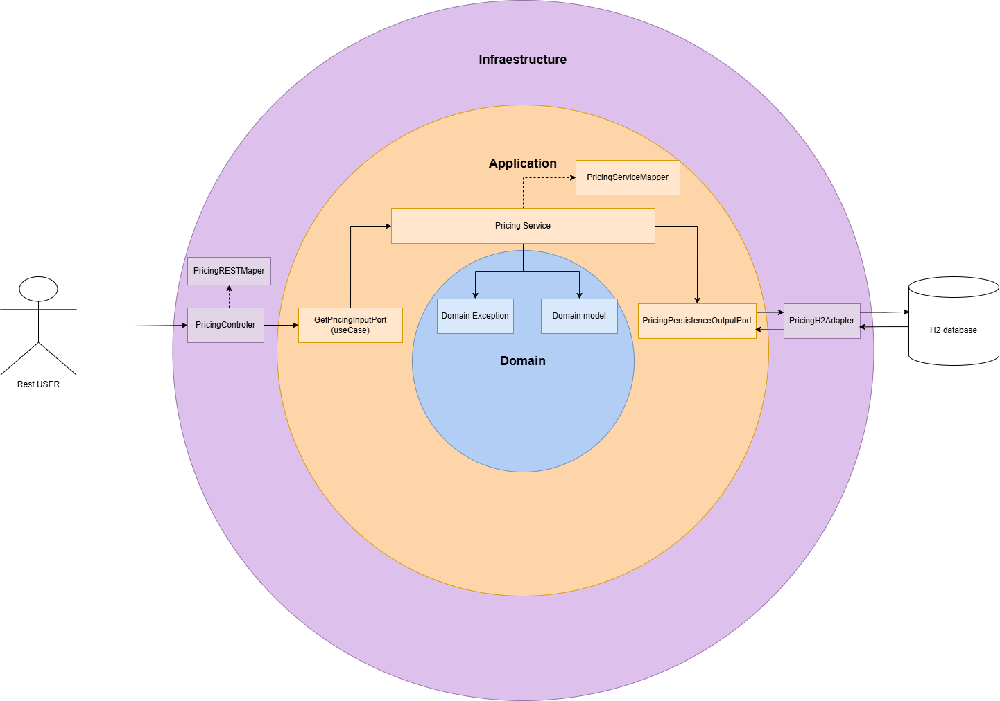

# Pricing Service Project

This project provides a REST API to obtain pricing information for specific products on given dates and brands.

## Technologies Used

- Java
- Spring Boot
- Maven
- Mockito
- JUnit
- H2 Database
- GitHub Actions for compiling and testing with maven

## Project Structure

The project uses hexagonal architecture and is organized into the following packages:

Architecture diagram:



- `com.inditex.pricing.application`: Contains business logic and services.
- `com.inditex.pricing.domain`: Contains exceptions and domain models.
- `com.inditex.pricing.infrastructure`: Contains controllers, mappers, and adapters.
- `com.inditex.pricing.application.ports`: Contains input and output ports for the application.

The  use of CQRS (Command Query Responsibility Segregation) was thought of but not implemented in this version since the project is simple and does not require it.
## Endpoints

### Get Pricing

- **URL**: `/api/prices/getPricing`
- **Method**: `GET`
- **Parameters**:
  - `date` (String): Date in the format `yyyy-MM-dd HH:mm:ss`.
  - `productId` (Long): Product ID.
  - `brandId` (Long): Brand ID.
- **Response**: Returns a `GetPricingRestResponse` object with the pricing information.

### Service Test

- **URL**: `/api/prices/test`
- **Method**: `GET`
- **Response**: Returns a test message.

## Exceptions

- `PriceNotFoundException`: Thrown when no pricing information is found for the given parameters. Returns a 404 status.

## Tests

Tests are located in the `src/test/java/com/inditex/pricing/infrastructure/controller` package. `MockMvc` and `Mockito` are used for unit and integration testing.

### Running Tests

To run the tests, with jacoco coverage included you can use the following Maven command:

```sh
mvn test
```

## Running the Project

To run the project, use the following Maven command:

```sh
mvn spring-boot:run
```
